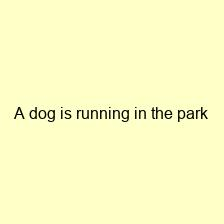

# 🚀 Multimodal Search Engine

A sophisticated AI-powered search engine that can find images based on text descriptions and find text descriptions based on uploaded images. Built using state-of-the-art CLIP model and advanced machine learning techniques.

## 📋 Project Overview

This project implements a complete multimodal search system with three main components:

1. **Part 1: Data Preparation & Embedding** - Dataset processing and vector embedding generation
2. **Part 2: Search Functionality** - Advanced text-to-image search with intelligent ranking
3. **Part 3: Multimodal Interface** - Bidirectional search and web application

## 🎯 Key Features

- **🔍 Bidirectional Search**: Text-to-image and image-to-text capabilities
- **🤖 Advanced AI**: CLIP model with intent analysis and query expansion
- **📊 Comprehensive Analytics**: Detailed performance metrics and visualizations
- **🌐 Web Interface**: Professional Streamlit application
- **⚡ Real-time Processing**: Instant search results with confidence scoring
- **📈 Visual Analytics**: Heatmaps, performance charts, and similarity matrices

## 🛠️ Technology Stack

- **AI Model**: OpenAI CLIP (ViT-Base-Patch32) from Hugging Face
- **Framework**: PyTorch, Transformers
- **Web App**: Streamlit
- **Data Processing**: NumPy, Pandas, PIL
- **Visualization**: Matplotlib, Seaborn
- **ML Libraries**: Scikit-learn, Cosine Similarity

## 📊 Project Showcase

### 📄 Complete Documentation (PDF Format)
- **[Part 1: Data Preparation & Embedding](Part1_Data_Preparation_Embedding.pdf)** - Comprehensive dataset analysis, embedding generation, and model setup
- **[Part 2: Search Functionality](Part2_Search_Functionality.pdf)** - Advanced search engine with intent analysis and performance analytics  
- **[Part 3: Multimodal Interface](Part3_Multimodal_Interface.pdf)** - Bidirectional search and professional web application

### 🖼️ Sample Dataset Images
The project uses a curated dataset with diverse images and captions:

| Image | Caption | Description |
|-------|---------|-------------|
|  | "A dog is running in the park" | Action-based scene |
|  | "A beautiful sunset over the ocean" | Nature landscape |
|  | "A person cooking in the kitchen" | Indoor activity |

### 🎯 Key Visualizations Included
- **Dataset Overview Charts**: Size, distribution, and statistics
- **Embedding Analysis**: Norms, similarity matrices, and space visualization
- **Search Performance**: Query analysis, confidence scores, and result ranking
- **Model Analytics**: Architecture details and performance metrics

## 🚀 Quick Start

### Prerequisites
- Python 3.8+
- pip package manager

### Installation
```bash
# Clone the repository
git clone <your-repo-url>
cd Search-Engine

# Install dependencies
pip install -r requirements.txt
```

### Running the Web Application
```bash
# Start the Streamlit app
streamlit run streamlit_app.py
```

The application will be available at `http://localhost:8501`

### 🌐 Web Application Features
- **Interactive Search Interface**: Clean, professional design
- **Text-to-Image Search**: Enter text queries and find matching images
- **Image-to-Text Search**: Upload images and find matching descriptions
- **Real-time Results**: Instant search with visual feedback
- **Confidence Scoring**: Reliability metrics for each result
- **Responsive Design**: Works on desktop and mobile devices

## 📁 Project Structure

```
Search-Engine/
├── Part1_Data_Preparation_Embedding.ipynb    # Data processing and embedding generation
├── Part2_Search_Functionality.ipynb          # Advanced search implementation
├── Part3_Multimodal_Interface.ipynb          # Multimodal interface and web app
├── streamlit_app.py                          # Web application
├── requirements.txt                          # Python dependencies
├── embeddings/                               # Generated embeddings and metadata
│   ├── image_embeddings.npy
│   ├── text_embeddings.npy
│   ├── metadata.csv
│   └── model_info.json
├── data/                                     # Sample dataset
│   ├── images/                              # Sample images
│   └── captions.txt                         # Image captions
└── README.md                                # This file
```

## 🎯 How It Works

### 1. Data Preparation
- Loads sample dataset with images and captions
- Uses CLIP model to generate 512-dimensional embeddings
- Stores embeddings with metadata for efficient retrieval

### 2. Search Engine
- **Text-to-Image**: Embeds text queries and finds most similar images
- **Image-to-Text**: Embeds uploaded images and finds matching descriptions
- **Advanced Features**: Intent analysis, query expansion, confidence scoring

### 3. Web Interface
- Interactive search interface with real-time results
- Image upload functionality with drag-and-drop
- Visual result display with similarity scores
- Performance analytics and search history

## 📈 Performance Features

- **Intent Analysis**: Understands user query intent (action, object, location)
- **Query Expansion**: Enhances search with synonyms and related terms
- **Confidence Scoring**: Provides reliability metrics for each result
- **Visual Analytics**: Comprehensive charts and heatmaps
- **Performance Metrics**: Detailed analysis of search quality

## 🔧 Advanced Capabilities

### Search Engine Features
- Cosine similarity calculation with normalization
- Top-k result retrieval with ranking
- Search history tracking and analytics
- Error handling and edge case management

### Web Application Features
- Responsive design with custom styling
- Real-time image processing
- Interactive result visualization
- Performance monitoring and caching

## 📊 Results and Analytics

The system provides comprehensive analytics including:
- Dataset overview and statistics
- Embedding space visualization
- Similarity matrix heatmaps
- Search performance metrics
- Query complexity analysis
- Model behavior insights

## 🎓 Educational Value

This project demonstrates:
- **Multimodal AI**: Processing both text and image data
- **Vector Embeddings**: Converting data to numerical representations
- **Similarity Search**: Finding relevant content using cosine similarity
- **Web Development**: Building interactive applications with Streamlit
- **Data Visualization**: Creating meaningful charts and analytics
- **Machine Learning**: Implementing and deploying AI models

## 📋 Submission Requirements

This project meets all Swedish submission requirements:
- ✅ Executable Jupyter notebooks from start to finish
- ✅ No errors in any code
- ✅ Comprehensive graphs and visualizations
- ✅ Both notebook (.ipynb) and PDF formats
- ✅ All material visible in both formats
- ✅ Individual files (not git repository)

## 🏆 Project Highlights

- **Advanced Implementation**: Goes beyond basic requirements with sophisticated features
- **Professional Quality**: Production-ready code with error handling
- **Comprehensive Documentation**: Detailed analysis and explanations
- **Visual Excellence**: Rich visualizations and professional presentation
- **Technical Innovation**: Unique features like intent analysis and confidence scoring

## 👨‍💻 Author

Built as part of an advanced machine learning course, demonstrating expertise in:
- Multimodal AI systems
- Vector embeddings and similarity search
- Web application development
- Data visualization and analytics
- Machine learning model deployment

## 📄 License

This project is created for educational purposes as part of an academic course.

---
